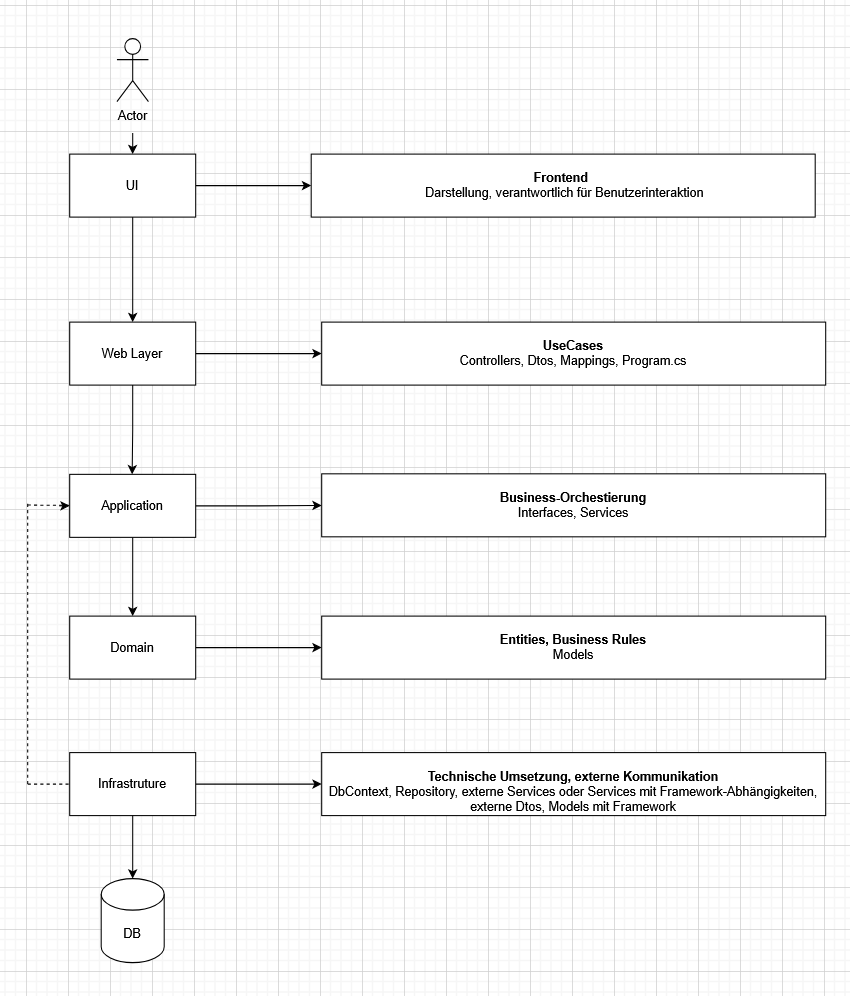

# WeatherForecast – Full-Stack Wetter App 

Eine kompakte Full-Stack-Anwendung zur Registrierung, Anmeldung, Wetterabfrage und Verwaltung persönlicher Favoriten.
Mit Fokus auf Clean Architecutre.

- Benutzerregistrierung & Login (ASP.NET Identity, JWT)
- Rollenmodell (**User / SuperUser**)
- Verwaltung von Wetter-Favoriten
- Modernes React-Frontend mit Dashboard, Karten & Icons


## Features

### Benutzer & Rollen

- Registrierung über das Frontend mit Checkbox (Wahl zwischen User & SuperUser)
- Login mit E-Mail & Passwort
- Rollen:
  - **User** - kann sich anmelden und Wetter abrufen
  - **SuperUser** - kann zusätzlich Favoriten speichern
- Geschützte Endpoints mit `[Authorize]` und `[Authorize(Roles = "SuperUser")]`

---

### Wetterfunktionen

- Aktuelles Wetter zu einer Stadt anhand von Stadtname und Ländercode (z. B. Berlin, DE)
- Werte unter anderem:
  - Temperatur & gefühlte Temperatur
  - Luftfeuchtigkeit
  - Komponente mit 3-Tage-Vorhersage
  - Komponente mit 5-Tage-Vorhersage
 
---

### Favoritensystem

- Favoriten sind an den angemeldeten Benutzer gekoppelt
- Pro Benutzer maximal 5 Favoriten
- Duplicate-Check (Städte können nicht mehrmals gespeichert werden)
- Komponente mit Auflistung der Favoriten + Löschfunktion in den Cards
- Bei Klick auf einen Favoriten Darstellung verschiedener Wetterdetails in Komponenten

---

### Frontend

- Modernes UI mit:
  - Sidebar (Navigation: Suche & Dashboard, Logout)
  - Suchansicht mit Formular (Stadt + Ländercode)
  - Dashboard mit:
    - Favoriten-Leiste
    - Aktuellem Wetter
    - Sonnenaufgang / -untergang
    - Komponentenbasierte Architektur (z.B.: SearchCard, FavoriteStrip, DashboardPage, SunriseSunsetCards)

   ---

## Architekturüberblick

  ### Backend (ASP.NET Core 9)



- UI(Frontend)    - Benutzerinteratkion & Darstellung
- Web Layer       - API, Validierung, Routing
- Application     - Business-Orchestrierung, UseCases
- Domain          - Reine Geschäftslogik ohne Framework
- Infrastructure  - Technische Umsetzung, externer Zugriff
- DB              - Persistenzschicht

**Abhängigkeiten zeichen nach innen**
 
  ---

## Tech Stack

**Frontend**

- React (Vite)
- React Router
- Tailwind CSS
- `lucide-react` Icons
- UI-Komponenten (z. B. Sidebar)

**Backend**

- ASP.NET Core Web API
- Entity Framework Core + MySQL
- ASP.NET Identity (User & Rollen)
- HttpClient für OpenWeatherMap
- Logging (`Microsoft.Extensions.Logging`)

**Externe Dienste**

- OpenWeatherMap - aktuelle Wetterdaten & Forecast

---

## Screenshots


### Backend Setup & Konfiguration

**Projekt klonen**
<pre>```
git clone
cd WeahterForecast
```</pre>


**.env Datei Im Projektroot anlegen**
```
OWM_API_KEY=DEIN_OPENWEATHERMAP_API_KEY
```

### Backend starten
```
docker compose up --build
```

**Backend läuft unter:**
- API     -> http://localhost:5000

**Backend stoppen**
```
docker compose down
```


### Frontend starten (React + Vite)

**ins Frontend wechseln**
```
cd WeatherForecast-React
```

**Abhängigkeiten installieren**
```
npm install
```

**Frontend starten**
```
npm run dev
```


## Motivation & Lernziele

Dieses Projekt entstand, um:

- Full-Stack Entwicklung mit .NET & React praktisch anzuwenden

- eine mehrschichtige Architektur mit Services, Repositories und DTOs zu implementieren

- realistische Themen wie Authentifizierung, Rollen, externe APIs und UI/UX zu kombinieren


## Autor

**Name:** Michael Bannach
**Rolle:** angehender Softwareentwickler


  
  
