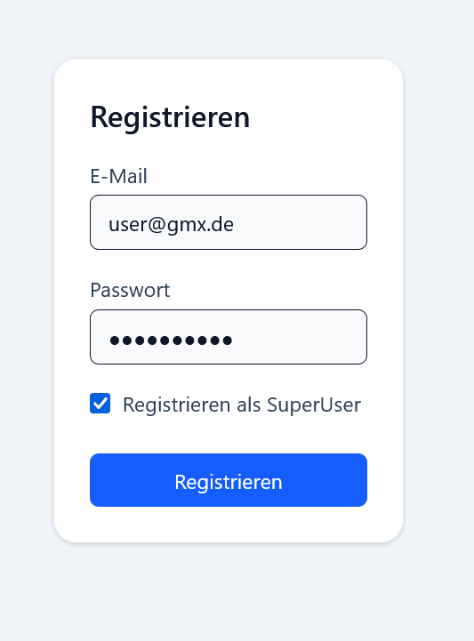
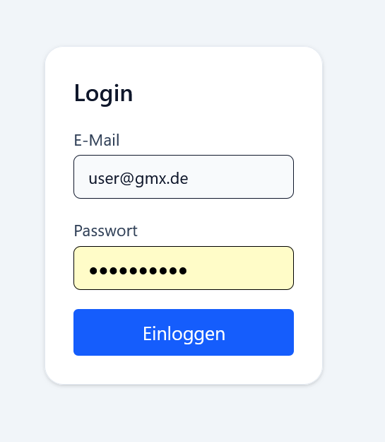
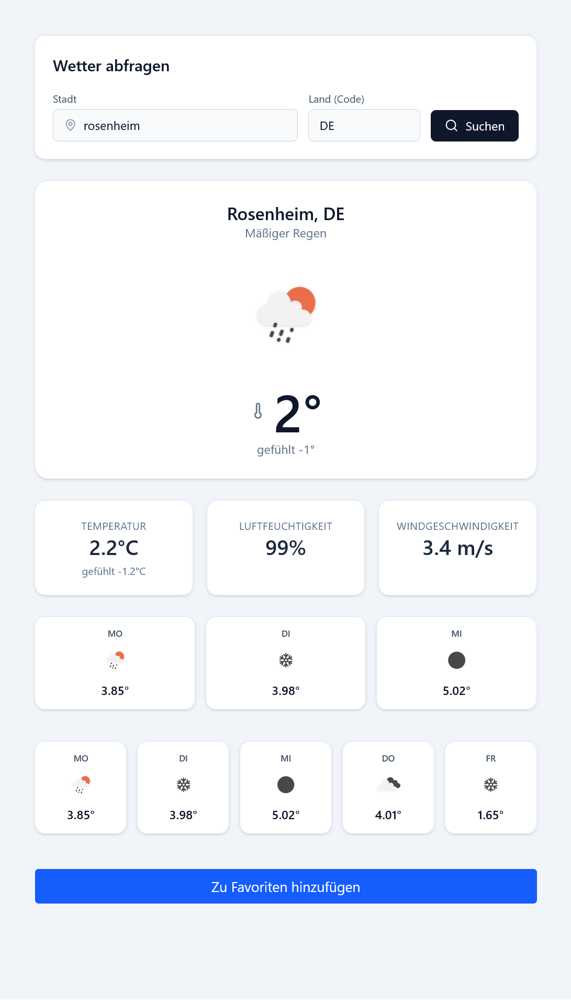
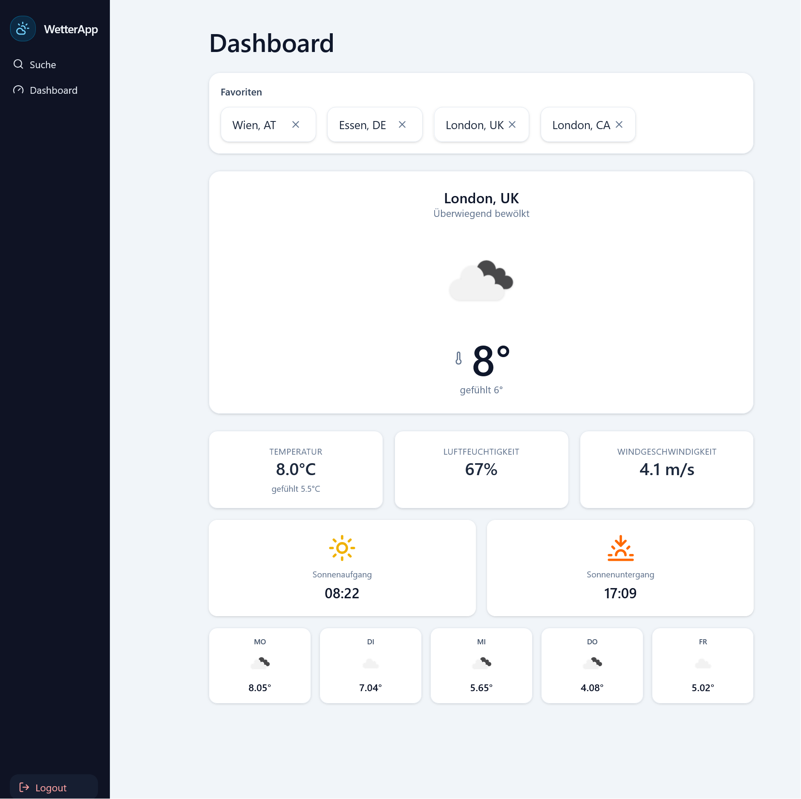

# WeatherForecast – Full-Stack Wetter App (ASP.NET Core + React)

WeatherForecast ist eine vollständige Full-Stack-Anwendung zur Abfrage von aktuellen Wetterdaten und Vorhersagen auf Basis der **OpenWeatherMap API**.  
Die App bietet:

- Benutzerregistrierung & Login (ASP.NET Identity, Cookie-Auth)
- Rollenmodell (**User / SuperUser**)
- Verwaltung von Wetter-Favoriten
- Modernes React-Frontend mit Dashboard, Karten & Icons


## Features

### Benutzer & Rollen

- Registrierung über das Frontend mit Checkbox (Wahl zwischen User & SuperUser)
- Login mit E-Mail & Passwort
- Rollen:
  - **User** - kann sich anmelden und Wetter abrufen
  - **SuperUser** - kann zusätzlich Favoriten speichern
- Geschützte Endpoints mit `[Authorize]` und `[Authorize(Roles = "SuperUser")]`

---

### Wetterfunktionen

- Aktuelles Wetter zu einer Stadt anhand von Stadtname und Ländercode (z. B. Berlin, DE)
- Werte unter anderem:
  - Temperatur & gefühlte Temperatur
  - Luftfeuchtigkeit
  - Komponente mit 3-Tage-Vorhersage
  - Komponente mit 5-Tage-Vorhersage
 
---

### Favoritensystem

- Favoriten sind an den angemeldeten Benutzer gekoppelt
- Pro Benutzer maximal 5 Favoriten
- Duplicate-Check (Städte können nicht mehrmals gespeichert werden)
- Komponente mit Auflistung der Favoriten + Löschfunktion in den Cards
- Bei Klick auf einen Favoriten Darstellung verschiedener Wetterdetails in Komponenten

---

### Frontend

- Modernes UI mit:
  - Sidebar (Navigation: Suche & Dashboard, Logout)
  - Suchansicht mit Formular (Stadt + Ländercode)
  - Dashboard mit:
    - Favoriten-Leiste
    - Aktuellem Wetter
    - Sonnenaufgang / -untergang
    - Komponentenbasierte Architektur (z.B.: SearchCard, FavoriteStrip, DashboardPage, SunriseSunsetCards)

   ---

  ### Backend (ASP.NET Core Web API)

- Mehrschichtige Architektur
  - Domain: Modelle (`ApplicationUser`, `Favorite`)
  - Application: Interfaces, DTOs, Mapping, Business-Logik (`FavoriteService`, `IWeatherService`, `IUserService`)
  - Infrastructure: EF Core, Repositories, externe API-Anbindung (OpenWeatherMap)
  - Web: Controller (WeatherController, FavoriteController, UserController, AuthController)
  - Datenbank: MySql 8 via EF Core
 
  ---

## Tech Stack

**Frontend**

- React (Vite)
- React Router
- Tailwind CSS
- `lucide-react` Icons
- UI-Komponenten (z. B. Sidebar)

**Backend**

- ASP.NET Core Web API
- Entity Framework Core + MySQL
- ASP.NET Identity (User & Rollen)
- HttpClient für OpenWeatherMap
- Logging (`Microsoft.Extensions.Logging`)

**Externe Dienste**

- OpenWeatherMap - aktuelle Wetterdaten & Forecast

---

## Screenshots













### Backend Setup & Konfiguration

Projekt klonen
<pre>```
git clone
cd WeahterForecast
```</pre>

Konfiguration(appsettings.json)
<pre>```
{
  "ConnectionStrings": {
    "DefaultConnection": "Server=localhost;Database=WeatherForecast;User Id=deinUser;Password=deinPasswort;"
  },
  "OpenWeatherMap": {
    "BaseUrl": "https://api.openweathermap.org/data/2.5/",
    "ApiKey": "<DEIN_OWM_API_KEY>"
  }
}
```</pre>

Migrationen/Datenbank
<pre>```
cd WeatherForecast.Infrastructure

dotnet ef database update
```</pre>

Backend starten
<pre>```
cd WeatherForecast.Web
dotnet run
```</pre>

### Frontend - Setup & Start

Abhängigkeit installieren
<pre>```
cd WeatherForecast-React
npm install
```</pre>

Dev-Server starten
```
npm run dev
```


## Motivation & Lernziele

Dieses Projekt entstand, um:

- Full-Stack Entwicklung mit .NET & React praktisch anzuwenden

- eine mehrschichtige Architektur mit Services, Repositories und DTOs zu implementieren

- realistische Themen wie Authentifizierung, Rollen, externe APIs und UI/UX zu kombinieren


# Autor
**Name:** Michael Bannach
**Rolle:** angehender Softwareentwickler


  
  
